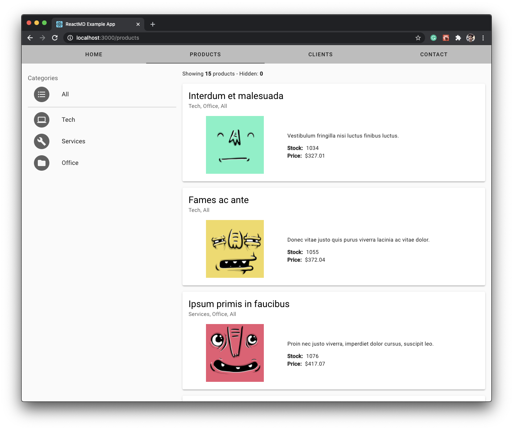

# My Company Single Page App



---

## About this project

- ⚛️ This project was bootstrapped with
[Create React App and react-MD](https://github.com/mlaursen/react-md/tree/master/examples/create-react-app).

- 🎨 The project uses [react-md](https://react-md.dev) as the component library and Sass for the additional styling.

- 🗄 The data was served using [My JSON server](https://my-json-server.typicode.com/) from my own repository's [db.json](./db.json) file.

 - 🔗 The routing was made through [React Router](https://reactrouter.com/web/guides/quick-start).

 - ⚓️ The project uses [React Hooks](https://reactjs.org/docs/hooks-intro.html) to manage the state in the App.

## What's Included

This example will setup an example Create React App + ReactMD app that has the
following features:

- [jsconfig.json](./jsconfig.json) to allow absolute imports instead of relative
  imports from the `"src"` directory
  - `import MyComponent from "components/MyComponent"` instead of
    `import MyComponent from "../../components/MyComponent"`
- [\_variables.scss](./src/_variables.scss) to override the default `react-md`
  theme and feature toggles
- a reusable [Layout.jsx](./src/components/Layout/Layout.jsx) that:
  - updates all the icons to use `SVGIcon`s instead of `FontIcon`s
  - initializes the `Layout` component from `react-md` with navigation items
  - uses [react-router-dom](https://www.npmjs.com/package/react-router-dom) as
    the routing library

## Run this repo in development mode

- 🐑 Clone this repo
```bash
  git clone https://github.com/josepplloo/my-company-spa.git
```
- 📊 Install dependencies
```
  cd my-company-spa && npm i
```
- 🏁 Start the server
```
npm start
```
- 💻 Now can view the website in your browser at http://localhost:3000/

## Wall of Shame

Several things I would've liked to do but I didn't have enough time. 

- Add proptypes and TypeScript for type checking.
- Deepen in `react-md` to get more familiar with the library and customize the theming and components.
- Add more unit tests.
- A global state management hook.
- Ask for the design specs.
- Add eslint configuration.
- Add post CSS config to avoid camel case styles in SASS files. 
